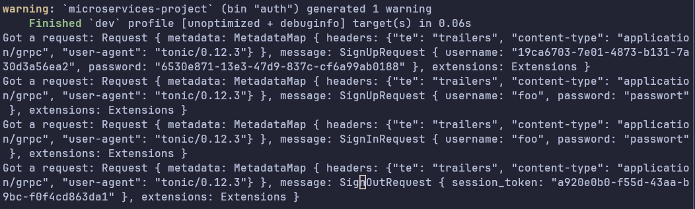
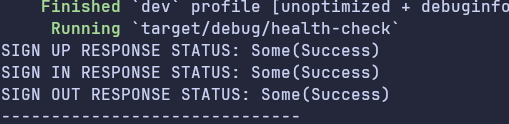
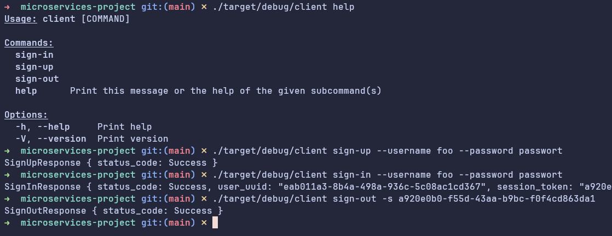
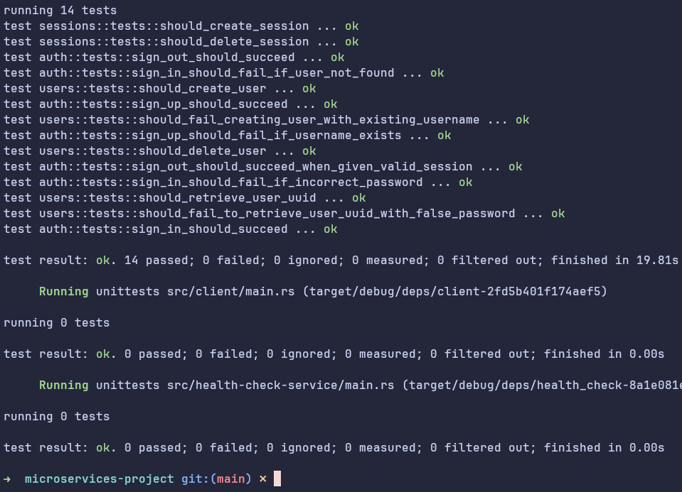

## App
Microservices project with Rust and gRPC.

Interface in [proto/authentication.proto](https://github.com/rsilva1/rs_bc_microservices_project/blob/main/proto/authentication.proto).

## Services

### Auth Service

Endpoints:

| Endpoint | Params |
| Sign Up | username (string); password (string) |
| Sign In | username (string); password (string) |
| Sign Out | session token (uuid string) |

### Health Check

Periodically pings Auth Service

### Client

CLI that communicates with Auth Service. Needs Auth Service to be running.

## Build

```
cargo build
```

## Run

```
docker-compose up
```

Or, alternatively:

```
cargo run --bin auth
```

```
cargo run --bin health-check
```


```
./target/debug/client help
```





## Test

```
cargo test
```


